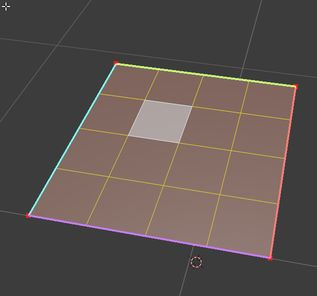

[Githubinfo][https://github.com/adam-p/markdown-here/wiki/Markdown-Cheatsheet#youtube-videos]

A First Level Header
====================

A Second Level Header
---------------------

### Header 3

# H1
## H2
### H3
#### H4
##### H5
###### H6

> This is a blockquote.
> 
> This is the second paragraph in the blockquote.
>
> ## This is an H2 in a blockquote

    Text boxes made with tabs

Emphasis
------------

Some of these words *are emphasized*.
Some of these words _are emphasized also_.

Use two asterisks for **strong emphasis**.
Or, if you prefer, __use two underscores instead__.

Lists
--------------------------
*   Candy.
*   Gum.
*   Booze.

+   Candy.
+   Gum.
+   Booze.

-   Candy.
-   Gum.
-   Booze.

1.  Red
2.  Green
3.  Blue

Links
-------------------------------------
This is an [example link](http://example.com/).

This is an [example link title](http://example.com/ "Some title").

I get 10 times more traffic from [Google][1] than from
[Yahoo][2] or [MSN][3].

[1]: http://google.com/        "Google"
[2]: http://search.yahoo.com/  "Yahoo Search"
[3]: http://search.msn.com/    "MSN Search"

I start my morning with a cup of coffee and
[The New York Times][NY Times].

[ny times]

[ny times]: http://www.nytimes.com/

Images
------------------------------

With reference: 

![alt text][id]

[id]: ./images/test_image.png "Title"

Youtube videos
---------------------------------

CODE
---------------------------------

I strongly recommend against using any `<blink>` tags.

I wish SmartyPants used named entities like `&mdash;`
instead of decimal-encoded entites like `&#8212;`.

If you want your page to validate under XHTML 1.0 Strict,
you've got to put paragraph tags in your blockquotes:

    <blockquote>
        
For example.

    </blockquote>
    

Tables
---------------

| Tables        |      Are      |  Cool |
| ------------- | :-----------: | ----: |
| col 3 is      | right-aligned | $1600 |
| col 2 is      |   centered    |   $12 |
| zebra stripes |   are neat    |    $1 |

| some       | other     | another    |
| :----:     | :-----:   | :-----:    |
| some       | other     | another    |
| some       | other     | another    |
| some       | other     | another    |
| some       | other     | another    |

#Horizontal Rules

---
***
___

